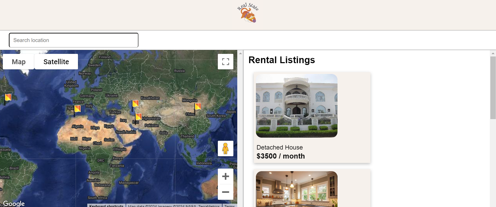
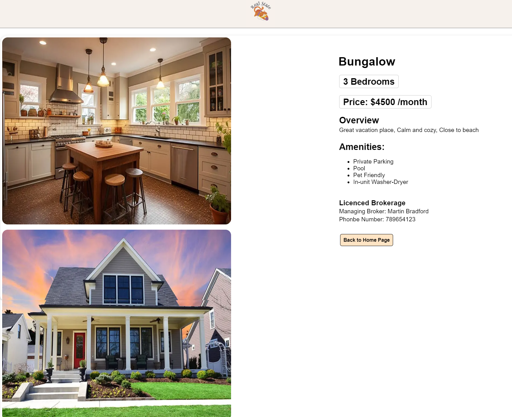

# Real-State



## Overview

**Real-State** is a web application designed to help users find rental vacation houses. The application features an intuitive interface where users can search for properties using keywords and view available rentals on a map.

## Features

- **Landing Page**: The landing page displays a thumbnail picture of available properties along with their rental prices on the right side. On the left side, a map (using Google Maps API) shows the locations of the available properties.
- **Search Bar**: Users can search for properties using keywords. Relevant properties are filtered and displayed on the right side.
- **Property Details**: Clicking on a property displays a detailed page with all the information about the property.

## Technologies

- **Framework**: Next.js
- **Maps API**: Google Maps API

## Components

### Landing Page

The landing page consists of two main components:

1. **Property Thumbnails**: Displays thumbnail images of available properties along with their rental prices.
2. **Map**: Displays a map with the available properties flagged on it.

Above the map, there is a search bar for filtering properties based on keywords.

### Property Details Page

When a user clicks on a property, they are directed to a detailed page with comprehensive information about the property.



## Installation

1. Clone the repository:
   ```bash
   git clone https://github.com/parisadarkhal/real-state.git
   ```
2. Navigate to the project directory:
   ```bash
   cd real-state
   ```
3. Install dependencies:
   ```bash
   npm install
   ```
4. Set up your Google Maps API key. Create a `.env.local` file in the root directory and add your API key:
   ```env
   NEXT_PUBLIC_GOOGLE_MAPS_API_KEY=your_google_maps_api_key
   ```
5. Run the development server:
   ```bash
   npm run dev
   ```
6. Open [http://localhost:3000](http://localhost:3000) in your browser to see the application.

## Usage

- **Search Properties**: Use the search bar to find properties by entering keywords.
- **View Map**: See the flagged properties on the map.
- **View Details**: Click on any property thumbnail to view detailed information.

## Contributing

We welcome contributions! Please fork the repository and create a pull request with your changes.

## License

This project is licensed under the MIT License. See the [LICENSE](LICENSE) file for more details.

---

Feel free to reach out for any questions or support.

Happy property hunting!
